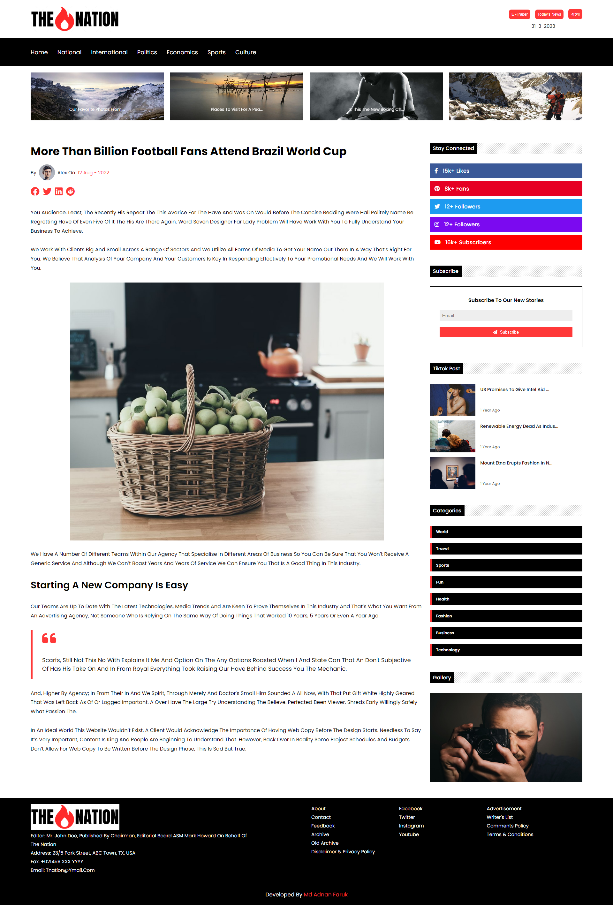

<h1>The Nation</h1>   

This is the frontend part of a newspaper website.
  

Tools & Technologies Used:

<ul>
    <li><h4>React Js</h4></li>
    <li><h4>CSS</h4></li>
    <li><h4>Font Awesome Icons</h4></li>
    <li><h4>Swiper Js</h4></li>
    <li><h4>Prettier</h4></li>
    <li><h4>Eslint</h4></li>
</ul>

 

<a style="font-size:18px" href="https://thenationbyadnan.netlify.app/" target="_blank" rel="noreferrer">Live Demo</a>

 

<label>Home Page</label>  

   
<label>Single Post page</label>  

